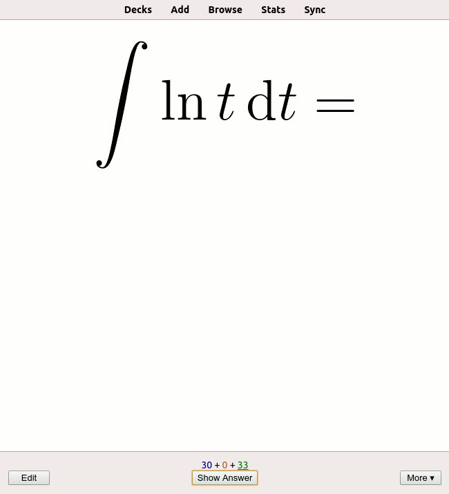

# Stage One, Card One

## Description

A flashcard is a digital or paper card that contains a term on one side, and a definition, translation, or explanation of that term on the other. Flashcards are often used for learning foreign languages and are an effective study technique for many people.



*An example of a flashcard. The upper part is the term the user is being asked, the lower part is the correct answer. Source: Wikipedia.*

For this project, we'll refer to the text on the front of the card as the **term**, and the text on the back will be the **definition**. There won't actually be any visual "front" and "back" side of a card: it'll all be done through sequential text. We'll ask the user for the definitions of the terms they previously entered, and check whether the given answers are correct. While developing this application, you will not only learn some programming but also save paper!

---

## Objectives

Your program should read two lines from the console, a **term**, and a **definition**, that represent a card.

Implement a program that outputs 4 lines:

* The first line is `Card:`
* The second line is the term provided by the user
* The third line is `Definition:`
* The fourth line is the definition which is also provided by the user

In this stage we are just laying the foundation for later stages, we'll start using these input values from next stage.

---

## Examples

Here are some output examples to clarify what the result should look like. The greater-than symbol followed by a space (`> `) represents the user input. Note that it's not part of the input.

**Example 1.**

```no-highlight
Card:
> purchase
purchase
Definition:
> buy
buy
```

**Example 2.**

```no-highlight
Card:
> cos'(x)
cos'(x)
Definition:
> -sin(x)
-sin(x)
```
